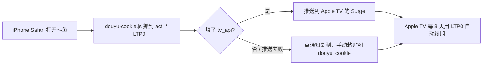

# surge-live：在 Apple TV 的 Surge 里直接解析虎牙 / 斗鱼直播流

不需要 VPS，也不需要常开设备。解析由 Apple TV 上的 Surge 脚本完成。

## 原理

1. APTV 打开 `http://live.surge/huya/123321`。`live.surge` 是个不存在的域名。
2. Surge 会给它分配一个假 IP，于是这条请求进入 Surge 的 HTTP 引擎，被 `live-redirect.js` 拦下。
3. 脚本用 Apple TV 自己的网络（DIRECT，也就是你家上海电信的 IP）去调虎牙或斗鱼的接口。
4. 脚本拿到真实的 FLV 地址，返回 302。
5. APTV 跟着跳转，从平台按**你的宽带**分配的 CDN 节点拉流。

整个过程没有中转服务器，视频流量也不经过任何第三方。

## 文件

| 文件 | 作用 |
|---|---|
| `live-redirect.sgmodule` | Surge 模块，负责挂上脚本，并把虎牙/斗鱼的接口和 CDN 强制直连 |
| `live-redirect.js` | 解析脚本 |
| `csgo.m3u` | 新的 APTV 列表 |
| `douyu-cookie.sgmodule` / `douyu-cookie.js` | 只装在 iPhone 上：打开斗鱼网页时自动抓登录 Cookie（含续期用的 LTP0），推送到 Apple TV，或点通知复制 |
| `tv-http-api.sgmodule` | 可选，只装在 Apple TV 上：打开 Surge 的局域网 HTTP API，接收 iPhone 推过来的 Cookie（实验性） |
| `tools/check-douyu-cookie.sh` | 在 Mac 上检查斗鱼 Cookie 能不能用 |
| `tools/test-douyu-renew.sh` | 在 Mac 上用真实登录验证 LTP0 自动续期（复制 passport.douyu.com 请求的 Cookie 后运行） |
| `tools/surge-mock.js` | 上面两个检查脚本用的 Surge 模拟环境 |

## 安装

Surge tvOS 没有设置界面，也读不到 iCloud Drive，所有配置都要在 **iPhone 的 Surge** 里改好，再部署到 Apple TV。

1. 把 `live-redirect.js` 和 `live-redirect.sgmodule` 放进 `jizh0u/streamlinks` 仓库的 `surge/` 目录。
   - 模块里的 `script-path` 写的是 `https://raw.githubusercontent.com/jizh0u/streamlinks/main/surge/live-redirect.js`。放到别的路径的话，记得改这一行。
2. 在 iPhone 的 Surge 里：模块 → 安装新模块，填入 `https://raw.githubusercontent.com/jizh0u/streamlinks/main/surge/live-redirect.sgmodule`。
   - 如果 Surge 访问不了 GitHub，模块地址和 `script-path` 两处都加上 `https://ghfast.top/` 前缀。
3. 要看斗鱼原画的话，按下面「斗鱼登录 Cookie」一节填好模块参数 `douyu_cookie`。不填也能用，只是游客档。
4. iPhone Surge → 更多 → Surge tvOS，部署到 Apple TV，并确认这个模块在 Apple TV 上是启用的。
5. 确认 Surge 的「脚本」功能是打开的。这个模块只用到 http-request 脚本，**不需要 MITM，也不需要装证书**。
6. 把 `csgo.m3u` 覆盖到仓库根目录，然后在 APTV 里刷新订阅。

## 地址格式

| 地址 | 含义 |
|---|---|
| `http://live.surge/huya/<房间号>` | 虎牙原画（默认，也就是虎牙播放器里最高那一档） |
| `http://live.surge/huya/<房间号>?ratio=20000` | 虎牙的“20M”转码，用来和原画对比 |
| `?ratio=max` | 房间档位表里码率最高的那一档转码 |
| `?cdn=al` / `tx` / `hs` | 指定虎牙 CDN。默认按虎牙给的权重选 |
| `?fmt=hls`，或在房间号后加 `.m3u8` | 虎牙改用 HLS（默认 FLV） |
| `http://live.surge/douyu/<房间号>` | 斗鱼能拿到的最高档：游客一般是蓝光4M，填了 Cookie 应该是原画（未验证） |
| `?cdn=hw-h5` / `tct-h5` … | 指定斗鱼线路。默认由斗鱼按你的 IP 分配 |
| `?rate=3` | 斗鱼指定档位：0 = 能拿到的最高，8 = 蓝光8M，4 = 蓝光4M，3 = 超清，2 = 高清 |

注意 `ratio=max` 只在档位表里找转码档。如果某个房间的原画本身就标着“蓝光20M”，转码档最高只有 8M，`max` 拿到的就是 8M，反而更差。

斗鱼房间号写靓号（6657）或真实房间号（6979222）都可以：
- 写靓号时，脚本第一次会查一次真实房间号，然后缓存起来。
- 列表里直接写真实房间号，可以省掉这次查询。

## 虎牙：为什么默认原画，而不是码率更高的“20M”

虎牙的档位表里，最高档（比如 CSBOY 的“蓝光30M”）的 `iBitRate` 是 0，表示主播推上来的原始流，请求时**不带** ratio。下面的“蓝光20M”“蓝光8M”等，都是虎牙服务器把原画解码后**再压一遍**得到的。档位名里的 30M、20M 只是标签，和实际码率没关系。

转码的输入就是原画。码率再高，也只能让它“更接近原画”，不可能比原画多出细节。这就像把一张 JPG 用更高的质量重新保存一遍：文件变大了，但画面不会比原图更清楚。多出来的码率，有不少花在重新编码原画里已有的压缩噪点上。

同一时刻、逐帧对齐的实测：

| 房间 | 原画 | “20M”转码 | 转码和原画相比 |
|---|---|---|---|
| 610731（CS2） | 1080p60，20.1 Mbps | 1080p60，20.1 Mbps | 码率一样，细节少 8–19%（PSNR 41.9 dB） |
| 579236（英雄联盟） | 1080p60，2.6 Mbps | 1080p60，4.5 Mbps | 码率高 1.7 倍，细节反而少 20–56%（PSNR 32.6 dB） |
| 546540（主机游戏，原画标“蓝光50M”） | 2560×1440，1.3 Mbps | 1920×1080，1.4 Mbps | 分辨率被降了，文字明显变糊 |
| 713352（恐怖游戏） | 2560×1440，30 Mbps | 2560×1440，13 Mbps | 几乎一样（PSNR 52.8 dB） |
| 998 | 2560×1440 | 1920×1080 | 分辨率被降了 |
| 123321（CSBOY，之前测的） | 1080p60，约 4.1 Mbps | 1080p60，约 7.0 Mbps | SEI 显示转码是从原画再处理一遍得到的 |

说明：
- “细节少 x%”指中高频的能量比原画低多少。
- 在 579236 上，转码最像“原画加一点模糊（σ≈0.4 像素）”的效果。

没有一个房间的转码比原画清楚：最好的情况是一样，常见的是稍软一点，最差的是分辨率被降。转码还要多花约 1.7 倍流量，晚高峰更容易卡。所以默认用原画。列表里另外放了一个 `CSBoy 20M转码`，你可以在电视上两个都看看，按观感留一个。

## 斗鱼登录 Cookie

### 为什么需要

从 2026-09-21 起，斗鱼网页接口对游客收紧了：
- 游客一般只给到蓝光4M（1080p **30** 帧）。原画是 1080p **60** 帧，看 CS 差别明显。
  - 实测游客偶尔也能拿到原画，是按请求随机给的，和设备号无关，很不稳定。18:07–18:12 的 41 次请求里有 7 次拿到原画，都集中在前几分钟，后面连续 19 次都是蓝光4M。
  - 所以脚本在没拿到原画时，最多再请求两次（每次打开频道最多 3 次请求）。能碰上就碰上，别指望它。
- 游客拿到的蓝光4M 和原画地址都带 `expire=300`。我实测，CDN 在第 300 秒准时断开连接，之后用旧地址重连返回 403。
  - 断流后，APTV 如果重新打开频道（重新请求 `live.surge`），脚本会给一个新地址，画面卡一下就继续。如果它只是重连旧地址，就会停住。这一点需要你在电视上连续看 5 分钟以上确认。
  - 超清（`?rate=3`，720p30）的游客地址是 `expire=0`。实测连续播放 340 秒没有断，旧地址也能重连。列表里的「玩机器 超清不断流」就是它，主频道老是停的话先用它顶着。

其他录播项目（biliLive-tools、bililive-go、biliup）的做法都是带上登录 Cookie。

### 方法一：在 iPhone 上自动抓取（推荐）

和常见的签到脚本一样：开着一个抓 Cookie 的模块，用 Safari 打开斗鱼网页，Surge 自动抓取并弹通知。

**整体流程**



**基础步骤**

1. 把 `douyu-cookie.js` 和 `douyu-cookie.sgmodule` 也放进仓库的 `surge/` 目录。
2. iPhone Surge → 模块 → 安装新模块，填入 `https://raw.githubusercontent.com/jizh0u/streamlinks/main/surge/douyu-cookie.sgmodule`。
3. 打开 MITM：
   - 如果还没配过：Surge → HTTPS 解密 → 生成证书并安装，再到「设置 → 通用 → 关于本机 → 证书信任设置」里打开对它的完全信任。
   - 然后打开 HTTPS 解密的总开关。模块只解密 `www.douyu.com`、`m.douyu.com`、`passport.douyu.com`。
4. 用 Safari 打开 https://www.douyu.com/6657 并登录。
   - 建议点地址栏的「大小」按钮，选「请求桌面网站」，用网页版登录。
   - 已经登录的话，刷新一下页面就行。
5. 脚本先向斗鱼确认这串 Cookie 确实处于登录状态，然后弹通知。
   - 只保留 `acf_*`、`dy_*` 和 `LTP0`，统计类 Cookie 会丢掉。
6. **补上 LTP0（开启自动续期）**：如果通知说「还没拿到 LTP0」，点这条通知，会打开 `passport.douyu.com`。脚本在那里抓到 LTP0 后会再弹一次通知。
   - 网页版斗鱼平时也会自己访问 passport，所以有时第一次就已经带上了。
7. 这个模块不要部署到 Apple TV。用完可以关掉，下次需要时再开。

**自动续期**

Cookie 里带了 LTP0 后，Apple TV 上的 `live-redirect.js` 会每 3 天用它向 `passport.douyu.com` 换一套新的 `acf_*`，做法和 bililive-go 一样。
- 续期在打开斗鱼频道时进行；模块里还有一个每 6 小时检查一次的 cron 任务，到期才真的续。
- 失败时：网络类错误 6 小时后重试；如果斗鱼说 LTP0 已失效，24 小时后再试，日志会提示「需要重新抓取」。这期间继续用旧 Cookie，过期就退回游客。
- 所以大约 2~3 个月（LTP0 的寿命）才需要在 iPhone 上重新打开一次斗鱼网页。

**二选一：Cookie 怎么到 Apple TV 上**

A. 手动粘贴（稳）：iPhone 模块的 `tv_api` 保持 `none`。点通知，Surge 会复制一串 `b64_` 开头的短字符串（只含 `dy_did` 和 `LTP0`，编码成字母数字）。粘贴到「虎牙/斗鱼直播」模块的 `douyu_cookie` 参数，重新部署到 Apple TV。电视第一次打开斗鱼频道时，会用它换出整套登录 Cookie。之后每 3 天自动续期，这一步几个月才做一次。

> [!TIP]
> 建议用通知复制出来的 `b64_...`，不要直接粘整串原始 Cookie。原始 Cookie 很长，里面可能有引号、逗号之类的字符，有弄坏脚本配置行的风险。脚本也兼容原始 Cookie。
>
> 如果 `http://live.surge/` 打不开、最近请求里显示落到 FINAL，先检查模块有没有在当前配置里启用、「脚本」开关有没有打开。

B. 自动推送（实验性，不用粘贴）：
1. 在路由器里给 Apple TV 设一个固定 IP（DHCP 静态分配），比如 `192.168.1.20`。
2. 生成一个随机 key，比如在 Mac 终端运行 `openssl rand -hex 16`。
3. 在要部署到 Apple TV 的配置里安装 `tv-http-api.sgmodule`，参数 `key` 填这个 key，然后部署。
   - 如果部署后不生效，就在配置文本的 `[General]` 里手动加一行 `http-api = <key>@0.0.0.0:6171` 再部署。
4. iPhone 上「斗鱼 Cookie 获取」模块的参数：`tv_api` 填 `192.168.1.20:6171`，`tv_key` 填同一个 key。
5. 主模块的 `douyu_cookie` 保持 `none`。
   - 原因：脚本只在参数**变化**时才采用参数里的 Cookie。如果参数里留着一份旧的、又从没在电视上用过，它第一次运行时会盖掉推过来的新 Cookie。
6. iPhone 和 Apple TV 在同一个局域网时，用 Safari 打开斗鱼。通知会显示「已推送到 Apple TV ✅」。
   - 如果推送失败，通知会写原因（连不上 / key 不对），点它就退回 A 的复制粘贴。10 分钟后再打开斗鱼会再推一次。

> [!WARNING]
> HTTP API 是明文 HTTP。知道 key 的局域网设备都能在 Apple TV 的 Surge 上执行脚本，所以 key 要随机，只在可信的家庭网络里用。不想开这个口子就用 A。

如果弹的是「Cookie 无效 ❌」，说明没登录或者登录已经过期。在 Safari 里重新登录、刷新页面即可。

去重规则：同一份登录处理成功后，12 小时内不再提醒；失败时最多每 10 分钟提醒一次。

抓到的 Cookie 也会存进这台 iPhone 自己的 `$persistentStore`。所以如果你在 iPhone 上也开着主模块，iPhone 上直接就能用。

### 方法二：在 Mac 上复制

1. 用 Chrome 或 Safari 打开 https://www.douyu.com 并登录（扫码即可）。
2. 打开任意一个直播间，比如 https://www.douyu.com/6657，确认网页上能切到「原画」。
3. 打开开发者工具（⌥⌘I）。
   - Safari 需要先在「设置 → 高级」里勾选「显示网页开发者功能」。
4. 切到「网络 / Network」面板，然后刷新页面。
5. 点列表里第一条请求，也就是名字为 `6657` 的那条。
6. 在「标头 / Headers」的「请求标头 / Request Headers」里找到 `Cookie`，复制它的整串值。
   - 不要用控制台的 `document.cookie`，它看不到 HttpOnly 的字段。
7. 复制完直接关掉标签页即可，**不要点「退出登录」**。退出登录一般会让这串 Cookie 跟着失效。

关键字段是 `acf_auth`、`acf_uid`、`acf_stk`、`acf_ltkid`、`acf_username`、`acf_biz`、`acf_ct`，外加 `dy_did`。脚本签名时会用 Cookie 里的 `dy_did` 作为设备号，必须和登录时的一致，所以整串复制最省事。

### 先在 Mac 上检查一下

复制好 Cookie 后，在终端运行：

```sh
zsh tools/check-douyu-cookie.sh   # 在仓库目录下运行
```

脚本读取剪贴板，不会打印 Cookie。它会：
- 检查关键字段是否齐全；
- 检查是否处于登录状态；
- 用 `live-redirect.js` 本身分别以游客和带 Cookie 的身份解析一次。

带 Cookie 那一行出现 `rate=0 原画1080P60`，就说明有效，同时还能看到 `expire` 变成了多少。玩机器没开播时，在命令后面加一个正在直播的斗鱼房间号。

### 填进 Surge

1. 在 Mac 上复制 Cookie，再到 iPhone 上粘贴（同一个 Apple ID 下有通用剪贴板）。
2. 在 iPhone Surge 的模块列表里，编辑这个模块的参数，把整串 Cookie 粘贴到 `douyu_cookie`。
3. 重新部署到 Apple TV。
4. 验证：
   - 看玩机器时画面是 60 帧，就说明拿到了原画。
   - 也可以在 Apple TV 的 Surge 主界面连按三下遥控器的播放键，打开调试菜单看日志。正常的话会有 `[live-redirect] douyu/6979222 ... rate=0 原画1080P60 ... [cookie]`。

如果日志里一直是 `[游客]`，说明参数没有同步到电视（文档没写部署时会不会带上模块参数，我没法验证）。这时可以这样做：
1. 在配置里把这个模块关掉。
2. 用 iPhone Surge 的文本模式编辑配置，把模块的三段内容直接写进配置：
   - `[General]` 里的 `force-http-engine-hosts` 加上 `live.surge`；
   - `[Rule]` 的最前面加上那几条 DIRECT 规则；
   - `[Script]` 里加下面这一行，把 `<COOKIE>` 换成你的 Cookie。
3. 再部署一次。

```
live-redirect = type=http-request,pattern=^https?:\/\/live\.surge(:\d+)?\/,script-path=https://raw.githubusercontent.com/jizh0u/streamlinks/main/surge/live-redirect.js,timeout=30,argument="douyu_cookie=<COOKIE>"
```

脚本取 Cookie 的顺序：
1. 模块参数 `douyu_cookie`，但只在它和上次采用的值**不同**时才采用（不然续期得到的新 Cookie 会被参数里的旧值盖掉）；
2. `$persistentStore` 里的 `live_redirect_douyu_auth`（续期结果、iPhone 推送的都存在这里）；
3. 旧版的 `live_redirect_douyu_cookie`。

### 有效期

- 据 bililive-go 的代码，`acf_*` 这些 Cookie 的有效期大约是 **6 天**（Max-Age 529200 秒）。
- `passport.douyu.com` 下的 `LTP0` 能用几个月。Cookie 里带上它，脚本就每 3 天自动续期一次（见上文「自动续期」）。
- 不带 LTP0 时，过期后脚本会自动退回游客档（蓝光4M），日志里会提示「cookie 可能已过期」。届时重新抓一次就行。

Cookie 就等于账号凭证。只填在 Surge 里，**不要放进公开仓库**，也不要发给别人。

## 需要注意

- **Surge 没开时 `live.surge` 打不开。** 所以列表里保留了 ttvb 的备用源。
- **DNS 要用国内的。** 解析接口和 CDN 已经被模块强制直连，但 Surge 的 DNS 最好也是国内的，比如 `system`、`223.5.5.5`、`119.29.29.29`。不要用海外 DoH，否则 CDN 可能分到外地甚至海外节点。
- **虎牙不需要登录。** 虎牙的流地址只校验脚本自己生成的防盗链参数（里面的 uid 是随机的），不校验登录态。游客就能拿到原画和所有转码档。
- 每次打开频道只会请求两三次接口，不会频繁刷接口。

## 排错

在 Apple TV 的 Surge 主界面连按三下遥控器的播放键，打开调试菜单看日志。脚本日志长这样：

```
[live-redirect] huya/123321 HS 蓝光30M -> http://hs.flv.huya.com/src/....flv?...
[live-redirect] douyu/6979222 hw-h5 rate=4 蓝光4M expire=300 [游客] -> https://hw3.douyucdn2.cn/live/..._4000.flv?...
```

斗鱼的日志末尾会有 `边缘=xxx`，那是斗鱼 CDN 302 跳转后、播放器真正连接的节点域名（例如华为云的 `*.livehwc4.com`）。这个域名必须走直连，否则会走代理而卡顿。模块已经把常见的直播 CDN 域名（华为云、腾讯云、网宿、阿里云）设成了 DIRECT。如果日志里出现「⚠️ 斗鱼 CDN 跳到了 xxx，模块的直连规则没覆盖它」，把这个域名加一条 DIRECT 规则即可。

返回码的含义：
- 404：未开播，或者房间不存在。
- 502：接口请求失败。

## 测试情况

已验证的部分：在 Mac 上用 JavaScriptCore 模拟了 Surge 的 `$httpClient`、`$done`、`$persistentStore`，把脚本完整跑了一遍，并实际拉流检查。
- 虎牙：
  - 123321：原画 1080p60；AL、TX、HS 三个 CDN 都能播。
  - 998：原画 1440p60。
  - 610731：原画 1080p60，20 Mbps。
  - HLS 正常。
- 斗鱼 6657 和 6979222：
  - 游客蓝光4M（1080p30，`expire=300`，CDN 在 300 秒时断开）。
  - 游客偶尔拿到的原画是真的 1080p60（实测 60.1 fps，约 4.6 Mbps），同样是 `expire=300`。
  - `rate=3` 得到超清 720p，`expire=0`，连续播放 340 秒不断。
- 斗鱼带 Cookie 的流程：用假 Cookie 走了一遍，能正确退回游客档，并给出提示。没拿到原画时的重试（最多 3 次请求）也走通了。
- 未开播的房间、不存在的房间：都返回 404。
- **真实账号验证（2026-10-06，Mac 上用 `tools/test-douyu-renew.sh`）**：
  - 浏览器打开 `passport.douyu.com` 首页时，请求里会带上 LTP0。
  - 只用 `dy_did + LTP0`（不带任何 `acf_*`）续期成功：safeAuth 302 到 `www.douyu.com/api/passport/login`，下发全套 `acf_*`，登录校验通过。
  - 用续期得到的 Cookie 解析玩机器，连续两次都是 `rate=0 原画1080P60`，而且 **`expire=0`**，也就是登录后原画不会每 5 分钟断一次。
- 自动续期：用假 LTP0 真实请求了 passport safeAuth，斗鱼回 `未登录`，脚本正确记为「LTP0 失效」、24 小时后再试，并继续用旧 Cookie；cron 模式、参数只在变化时采用，也都走通。带 Cookie 的请求被斗鱼回 502 时，会退回游客重试。
- `douyu-cookie.js`：在模拟环境里用本机假冒的「Apple TV 接口」测了推送成功、key 错误、连不上、`change-me`、没填 tv_api 几种情况；把推过去的脚本在一个空的 store 里执行，`live_redirect_douyu_auth` 写入正确，`live-redirect.js` 能读到。

没有验证的部分：
- 真正在 Surge tvOS 上运行，以及模块参数会不会随部署同步到电视。我没有设备。
- APTV 在斗鱼断流后会不会重新请求 `live.surge`。
- `douyu-cookie.js` 只在模拟环境里测过，没在真 iPhone 上跑过。斗鱼手机版网页登录后给的 Cookie 和桌面版是否一样也没确认，所以建议用「请求桌面网站」登录。
- Surge tvOS 是否支持 `http-api`、能否通过模块开启、`/v1/scripting/evaluate` 在 tvOS 上能否写 `$persistentStore`。官方文档只写了 iOS / Mac。不行就用手动粘贴。
- Surge tvOS 上 cron 脚本会不会按时跑。不跑也没关系，打开斗鱼频道时也会检查续期。
- 上海电信具体会分到哪个 CDN 节点。我这台机器的出口在东京。
